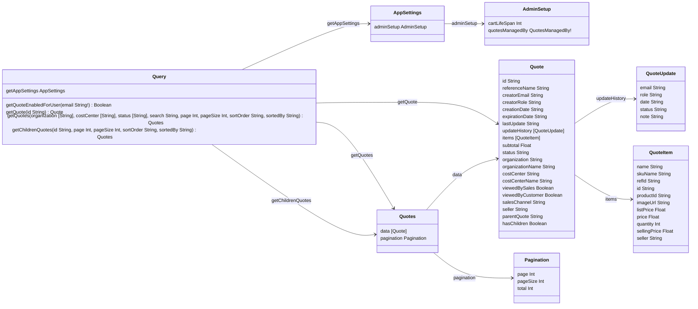
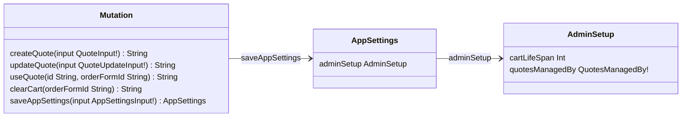

# B2B Quotes GraphQL API

This article provides a reference guide to the B2B Quotes GraphQL API, with details about the available queries and mutations for the [B2B Quotes app](https://developers.vtex.com/docs/apps/vtex.b2b-quotes). The API supports quote management and related configurations in a B2B environment, enabling users to retrieve, create, and update quotes, as well as manage application settings and permissions.

## Schema overview

### Query

<table>
  <thead>
    <tr>
      <th align="left">Field</th>
      <th align="right">Argument</th>
      <th align="left">Type</th>
      <th align="left">Description</th>
    </tr>
  </thead>
  <tbody>
    <tr>
      <td colspan="2" valign="top"><strong>getAppSettings</strong></td>
      <td valign="top"><a href="#appsettings">AppSettings</a></td>
      <td>Retrieves the current configuration settings of the B2B Quotes app.</td>
    </tr>
    <tr>
      <td colspan="2" valign="top"><strong>getQuoteEnabledForUser</strong></td>
      <td valign="top">Boolean</td>
      <td>Checks if the specified user has permission to use the quotes feature.</td>
    </tr>
    <tr>
      <td colspan="2" align="right" valign="top">email</td>
      <td valign="top">String!</td>
      <td>Email address of the user to check permissions for.</td>
    </tr>
    <tr>
      <td colspan="2" valign="top"><strong>getQuote</strong></td>
      <td valign="top"><a href="#quote">Quote</a></td>
      <td>Retrieves a specific quote by ID.</td>
    </tr>
    <tr>
      <td colspan="2" align="right" valign="top">id</td>
      <td valign="top">String</td>
      <td>Unique identifier of the quote to retrieve.</td>
    </tr>
    <tr>
      <td colspan="2" valign="top"><strong>getQuotes</strong></td>
      <td valign="top"><a href="#quotes">Quotes</a></td>
      <td>Retrieves a paginated list of quotes and saved carts with optional filters.</td>
    </tr>
    <tr>
      <td colspan="2" align="right" valign="top">organization</td>
      <td valign="top">[String]</td>
      <td>Filters quotes and saved carts by organization IDs.</td>
    </tr>
    <tr>
      <td colspan="2" align="right" valign="top">costCenter</td>
      <td valign="top">[String]</td>
      <td>Filters quotes and saved carts by cost center IDs.</td>
    </tr>
    <tr>
      <td colspan="2" align="right" valign="top">status</td>
      <td valign="top">[String]</td>
      <td>Filters by status: READY, PENDING, REVISED, DECLINED, EXPIRED, or PLACED.</td>
    </tr>
    <tr>
      <td colspan="2" align="right" valign="top">search</td>
      <td valign="top">String</td>
      <td>Searches quotes and saved carts by reference name.</td>
    </tr>
    <tr>
      <td colspan="2" align="right" valign="top">page</td>
      <td valign="top">Int</td>
      <td>Page number for pagination.</td>
    </tr>
    <tr>
      <td colspan="2" align="right" valign="top">pageSize</td>
      <td valign="top">Int</td>
      <td>Number of quotes per page.</td>
    </tr>
    <tr>
      <td colspan="2" align="right" valign="top">sortOrder</td>
      <td valign="top">String</td>
      <td>Specifies the sort direction (ASC or DESC).</td>
    </tr>
    <tr>
      <td colspan="2" align="right" valign="top">sortedBy</td>
      <td valign="top">String</td>
      <td>Field to sort the quotes by.</td>
    </tr>
    <tr>
      <td colspan="2" valign="top"><strong>getChildrenQuotes</strong></td>
      <td valign="top"><a href="#quotes">Quotes</a></td>
      <td>Retrieves child quotes associated with a parent quote.</td>
    </tr>
    <tr>
      <td colspan="2" align="right" valign="top">id</td>
      <td valign="top">String</td>
      <td>ID of the parent quote.</td>
    </tr>
    <tr>
      <td colspan="2" align="right" valign="top">page</td>
      <td valign="top">Int</td>
      <td>Page number for pagination.</td>
    </tr>
    <tr>
      <td colspan="2" align="right" valign="top">pageSize</td>
      <td valign="top">Int</td>
      <td>Number of child quotes per page.</td>
    </tr>
    <tr>
      <td colspan="2" align="right" valign="top">sortOrder</td>
      <td valign="top">String</td>
      <td>Specifies the sort direction (ASC or DESC).</td>
    </tr>
    <tr>
      <td colspan="2" align="right" valign="top">sortedBy</td>
      <td valign="top">String</td>
      <td>Field to sort the child quotes by.</td>
    </tr>
  </tbody>
</table>

### Mutation

<table>
  <thead>
    <tr>
      <th align="left">Field</th>
      <th align="right">Argument</th>
      <th align="left">Type</th>
      <th align="left">Description</th>
    </tr>
  </thead>
  <tbody>
    <tr>
      <td colspan="2" valign="top"><strong>createQuote</strong></td>
      <td valign="top">String</td>
      <td>Creates a new quote (PENDING status) or saved cart (READY status) from the current shopping cart.</td>
    </tr>
    <tr>
      <td colspan="2" align="right" valign="top">input</td>
      <td valign="top"><a href="#quoteinput">QuoteInput</a>!</td>
      <td>Input data for creating a new quote.</td>
    </tr>
    <tr>
      <td colspan="2" valign="top"><strong>updateQuote</strong></td>
      <td valign="top">String</td>
      <td>Updates an existing quote or saved cart, including price adjustments, quantities, and status changes.</td>
    </tr>
    <tr>
      <td colspan="2" align="right" valign="top">input</td>
      <td valign="top"><a href="#quoteupdateinput">QuoteUpdateInput</a>!</td>
      <td>Input data for updating the quote.</td>
    </tr>
    <tr>
      <td colspan="2" valign="top"><strong>useQuote</strong></td>
      <td valign="top">String</td>
      <td>Applies a quote or saved cart to the current shopping cart and redirects to checkout.</td>
    </tr>
    <tr>
      <td colspan="2" align="right" valign="top">id</td>
      <td valign="top">String</td>
      <td>ID of the quote to be applied.</td>
    </tr>
    <tr>
      <td colspan="2" align="right" valign="top">orderFormId</td>
      <td valign="top">String</td>
      <td>ID of the order form to apply the quote to.</td>
    </tr>
    <tr>
      <td colspan="2" valign="top"><strong>clearCart</strong></td>
      <td valign="top">String</td>
      <td>Removes all items from the current shopping cart before applying a quote.</td>
    </tr>
    <tr>
      <td colspan="2" align="right" valign="top">orderFormId</td>
      <td valign="top">String</td>
      <td>ID of the order form to be cleared.</td>
    </tr>
    <tr>
      <td colspan="2" valign="top"><strong>saveAppSettings</strong></td>
      <td valign="top"><a href="#appsettings">AppSettings</a></td>
      <td>Updates the B2B Quotes app settings.</td>
    </tr>
    <tr>
      <td colspan="2" align="right" valign="top">input</td>
      <td valign="top"><a href="#appsettingsinput">AppSettingsInput</a>!</td>
      <td>New configuration to be saved.</td>
    </tr>
  </tbody>
</table>

## Schema description

> ⚠️ Arguments must be provided by the user. Required fields are marked with an exclamation mark (`!`).

### AppSettings

<table>
  <thead>
    <tr>
      <th align="left">Field</th>
      <th align="left">Type</th>
      <th align="left">Description</th>
    </tr>
  </thead>
  <tbody>
    <tr>
      <td valign="top"><strong>adminSetup</strong></td>
      <td valign="top"><a href="#adminsetup">AdminSetup</a></td>
      <td>Configuration settings for the B2B Quotes admin.</td>
    </tr>
  </tbody>
</table>

<a href="#query">Query</a> 🔼

<a href="#mutation">Mutation</a> 🔼

### AppSettingsInput

<table>
  <thead>
    <tr>
      <th align="left">Field</th>
      <th align="left">Type</th>
      <th align="left">Description</th>
    </tr>
  </thead>
  <tbody>
    <tr>
      <td valign="top"><strong>cartLifeSpan</strong></td>
      <td valign="top">Int</td>
      <td>Default expiration period in days for quotes and saved carts. The minimum value is 1 day.</td>
    </tr>
    <tr>
      <td valign="top"><strong>quotesManagedBy</strong></td>
      <td valign="top"><a href="#quotesmanagedby">QuotesManagedBy</a></td>
      <td>Defines who has permission to manage quotes (marketplace admins or individual sellers).</td>
    </tr>
  </tbody>
</table>

<a href="#mutation">Mutation</a> 🔼

### AdminSetup

<table>
  <thead>
    <tr>
      <th align="left">Field</th>
      <th align="left">Type</th>
      <th align="left">Description</th>
    </tr>
  </thead>
  <tbody>
    <tr>
      <td valign="top"><strong>cartLifeSpan</strong></td>
      <td valign="top">Int</td>
      <td>Default expiration period in days for quotes and saved carts. The minimum value is 1 day.</td>
    </tr>
    <tr>
      <td valign="top"><strong>quotesManagedBy</strong></td>
      <td valign="top"><a href="#quotesmanagedby">QuotesManagedBy</a>!</td>
      <td>Defines who has permission to manage quotes (marketplace administrators or individual sellers).</td>
    </tr>
  </tbody>
</table>

<a href="#appsettings">AppSettings</a> 🔼

### Quotes

<table>
  <thead>
    <tr>
      <th align="left">Field</th>
      <th align="left">Type</th>
      <th align="left">Description</th>
    </tr>
  </thead>
  <tbody>
    <tr>
      <td valign="top"><strong>data</strong></td>
      <td valign="top">[<a href="#quote">Quote</a>]</td>
      <td>Array of quotes matching the query parameters.</td>
    </tr>
    <tr>
      <td valign="top"><strong>pagination</strong></td>
      <td valign="top"><a href="#pagination">Pagination</a></td>
      <td>Pagination details for the quotes list.</td>
    </tr>
  </tbody>
</table>

<a href="#query">Query</a> 🔼

### Quote

<table>
  <thead>
    <tr>
      <th align="left">Field</th>
      <th align="left">Type</th>
      <th align="left">Description</th>
    </tr>
  </thead>
  <tbody>
    <tr>
      <td valign="top"><strong>id</strong></td>
      <td valign="top">String</td>
      <td>Unique identifier for the quote.</td>
    </tr>
    <tr>
      <td valign="top"><strong>referenceName</strong></td>
      <td valign="top">String</td>
      <td>User-defined name to identify the quote or saved cart.</td>
    </tr>
    <tr>
      <td valign="top"><strong>creatorEmail</strong></td>
      <td valign="top">String</td>
      <td>Email address of the user who created the quote.</td>
    </tr>
    <tr>
      <td valign="top"><strong>creatorRole</strong></td>
      <td valign="top">String</td>
      <td>Role of the user who created the quote.</td>
    </tr>
    <tr>
      <td valign="top"><strong>creationDate</strong></td>
      <td valign="top">String</td>
      <td>Date and time when the quote was created.</td>
    </tr>
    <tr>
      <td valign="top"><strong>expirationDate</strong></td>
      <td valign="top">String</td>
      <td>Date and time when the quote will expire.</td>
    </tr>
    <tr>
      <td valign="top"><strong>lastUpdate</strong></td>
      <td valign="top">String</td>
      <td>Date of the last time when the quote or saved cart was updated.</td>
    </tr>
    <tr>
      <td valign="top"><strong>updateHistory</strong></td>
      <td valign="top">[<a href="#quoteupdate">QuoteUpdate</a>]</td>
      <td>History of all events related to the quote, including creation, discounts, and notes.</td>
    </tr>
    <tr>
      <td valign="top"><strong>items</strong></td>
      <td valign="top">[<a href="#quoteitem">QuoteItem</a>]</td>
      <td>Products included in the quote.</td>
    </tr>
    <tr>
      <td valign="top"><strong>subtotal</strong></td>
      <td valign="top">Float</td>
      <td>Total price of all items, including any discounts offered by sales associates.</td>
    </tr>
    <tr>
      <td valign="top"><strong>status</strong></td>
      <td valign="top">String</td>
      <td>
        Current status of the quote. Possible values are:
        <ul>
          <li>READY (ready to place the order)</li>
          <li>PENDING (waiting for review)</li>
          <li>REVISED (waiting for additional review)</li>
          <li>DECLINED (can't be used)</li>
          <li>EXPIRED (past expiration date)</li>
          <li>PLACED (already used)</li>
        </ul>
      </td>
    </tr>
    <tr>
      <td valign="top"><strong>organization</strong></td>
      <td valign="top">String</td>
      <td>ID of the organization the quote belongs to.</td>
    </tr>
    <tr>
      <td valign="top"><strong>organizationName</strong></td>
      <td valign="top">String</td>
      <td>Name of the organization the quote belongs to.</td>
    </tr>
    <tr>
      <td valign="top"><strong>costCenter</strong></td>
      <td valign="top">String</td>
      <td>ID of the cost center associated with the quote.</td>
    </tr>
    <tr>
      <td valign="top"><strong>costCenterName</strong></td>
      <td valign="top">String</td>
      <td>Name of the cost center associated with the quote.</td>
    </tr>
    <tr>
      <td valign="top"><strong>viewedBySales</strong></td>
      <td valign="top">Boolean</td>
      <td>Indicates if a sales associate has viewed the quote or saved cart.</td>
    </tr>
    <tr>
      <td valign="top"><strong>viewedByCustomer</strong></td>
      <td valign="top">Boolean</td>
      <td>Indicates if the customer has viewed the quote or saved cart.</td>
    </tr>
    <tr>
      <td valign="top"><strong>salesChannel</strong></td>
      <td valign="top">String</td>
      <td>Sales channel associated with the quote or saved cart.</td>
    </tr>
    <tr>
      <td valign="top"><strong>seller</strong></td>
      <td valign="top">String</td>
      <td>ID of the seller associated with the quote.</td>
    </tr>
    <tr>
      <td valign="top"><strong>parentQuote</strong></td>
      <td valign="top">String</td>
      <td>ID of the parent quote if this is a child quote.</td>
    </tr>
    <tr>
      <td valign="top"><strong>hasChildren</strong></td>
      <td valign="top">Boolean</td>
      <td>Indicates if this quote has associated child quotes.</td>
    </tr>
  </tbody>
</table>

<a href="#query">Query</a> 🔼

<a href="#quotes">Quotes</a> 🔼

### QuoteInput

<table>
  <thead>
    <tr>
      <th align="left">Field</th>
      <th align="left">Type</th>
      <th align="left">Description</th>
    </tr>
  </thead>
  <tbody>
    <tr>
      <td valign="top"><strong>referenceName</strong></td>
      <td valign="top">String</td>
      <td>User-defined name to identify the quote.</td>
    </tr>
    <tr>
      <td valign="top"><strong>items</strong></td>
      <td valign="top">[<a href="#quoteiteminput">QuoteItemInput</a>]</td>
      <td>List of products to include in the quote.</td>
    </tr>
    <tr>
      <td valign="top"><strong>subtotal</strong></td>
      <td valign="top">Float</td>
      <td>Total price of all items, including any discounts offered by sales associates.</td>
    </tr>
    <tr>
      <td valign="top"><strong>note</strong></td>
      <td valign="top">String</td>
      <td>Optional note that will be visible in the quote's update history to salespeople and organization members.</td>
    </tr>
    <tr>
      <td valign="top"><strong>sendToSalesRep</strong></td>
      <td valign="top">Boolean</td>
      <td>If true, creates a quote with PENDING status for sales review. If false, creates a saved cart with READY status.</td>
    </tr>
  </tbody>
</table>

<a href="#mutation">Mutation</a> 🔼

### QuoteUpdate

<table>
  <thead>
    <tr>
      <th align="left">Field</th>
      <th align="left">Type</th>
      <th align="left">Description</th>
    </tr>
  </thead>
  <tbody>
    <tr>
      <td valign="top"><strong>email</strong></td>
      <td valign="top">String</td>
      <td>Email of the user who made the update.</td>
    </tr>
    <tr>
      <td valign="top"><strong>role</strong></td>
      <td valign="top">String</td>
      <td>Role of the user who made the update (such as sales associate or organization buyer).</td>
    </tr>
    <tr>
      <td valign="top"><strong>date</strong></td>
      <td valign="top">String</td>
      <td>Date when the update was made.</td>
    </tr>
    <tr>
      <td valign="top"><strong>status</strong></td>
      <td valign="top">String</td>
      <td>Status change made in this update, if any.</td>
    </tr>
    <tr>
      <td valign="top"><strong>note</strong></td>
      <td valign="top">String</td>
      <td>Optional comment or instruction added during this update.</td>
    </tr>
  </tbody>
</table>

<a href="#quote">Quote</a> 🔼

### QuoteItem

<table>
  <thead>
    <tr>
      <th align="left">Field</th>
      <th align="left">Type</th>
      <th align="left">Description</th>
    </tr>
  </thead>
  <tbody>
    <tr>
      <td valign="top"><strong>name</strong></td>
      <td valign="top">String</td>
      <td>Product name.</td>
    </tr>
    <tr>
      <td valign="top"><strong>skuName</strong></td>
      <td valign="top">String</td>
      <td>Name of the specific SKU variant.</td>
    </tr>
    <tr>
      <td valign="top"><strong>refId</strong></td>
      <td valign="top">String</td>
      <td>Reference ID of the product.</td>
    </tr>
    <tr>
      <td valign="top"><strong>imageUrl</strong></td>
      <td valign="top">String</td>
      <td>URL of the product image.</td>
    </tr>
    <tr>
      <td valign="top"><strong>listPrice</strong></td>
      <td valign="top">Float</td>
      <td>Original price before any discounts.</td>
    </tr>
    <tr>
      <td valign="top"><strong>price</strong></td>
      <td valign="top">Float</td>
      <td>Original product price before any discounts.</td>
    </tr>
    <tr>
      <td valign="top"><strong>quantity</strong></td>
      <td valign="top">Int</td>
      <td>Number of items.</td>
    </tr>
    <tr>
      <td valign="top"><strong>sellingPrice</strong></td>
      <td valign="top">Float</td>
      <td>Product price including any discounts offered by sales associates.</td>
    </tr>
  </tbody>
</table>

<a href="#quote">Quote</a> 🔼

### QuoteUpdateInput

<table>
  <thead>
    <tr>
      <th align="left">Field</th>
      <th align="left">Type</th>
      <th align="left">Description</th>
    </tr>
  </thead>
  <tbody>
    <tr>
      <td valign="top"><strong>id</strong></td>
      <td valign="top">String</td>
      <td>Unique identifier of the quote to be updated.</td>
    </tr>
    <tr>
      <td valign="top"><strong>items</strong></td>
      <td valign="top">[<a href="#quoteiteminput">QuoteItemInput</a>]</td>
      <td>Updated list of products with their quantities and prices.</td>
    </tr>
    <tr>
      <td valign="top"><strong>subtotal</strong></td>
      <td valign="top">Float</td>
      <td>Updated total price of all items.</td>
    </tr>
    <tr>
      <td valign="top"><strong>note</strong></td>
      <td valign="top">String</td>
      <td>Optional comment or instruction that will be displayed in the quote's update history.</td>
    </tr>
    <tr>
      <td valign="top"><strong>decline</strong></td>
      <td valign="top">Boolean</td>
      <td>When true, changes the quote status to DECLINED, preventing further use.</td>
    </tr>
    <tr>
      <td valign="top"><strong>expirationDate</strong></td>
      <td valign="top">String</td>
      <td>New expiration date for the quote or saved cart.</td>
    </tr>
  </tbody>
</table>

<a href="#mutation">Mutation</a> 🔼

### QuoteItemInput

<table>
  <thead>
    <tr>
      <th align="left">Field</th>
      <th align="left">Type</th>
      <th align="left">Description</th>
    </tr>
  </thead>
  <tbody>
    <tr>
      <td valign="top"><strong>name</strong></td>
      <td valign="top">String</td>
      <td>Product name.</td>
    </tr>
    <tr>
      <td valign="top"><strong>skuName</strong></td>
      <td valign="top">String</td>
      <td>Name of the specific SKU variant.</td>
    </tr>
    <tr>
      <td valign="top"><strong>refId</strong></td>
      <td valign="top">String</td>
      <td>Reference ID of the product.</td>
    </tr>
    <tr>
      <td valign="top"><strong>id</strong></td>
      <td valign="top">String</td>
      <td>Unique identifier for the SKU.</td>
    </tr>
    <tr>
      <td valign="top"><strong>productId</strong></td>
      <td valign="top">String</td>
      <td>Unique identifier for the product.</td>
    </tr>
    <tr>
      <td valign="top"><strong>imageUrl</strong></td>
      <td valign="top">String</td>
      <td>URL of the product image.</td>
    </tr>
    <tr>
      <td valign="top"><strong>listPrice</strong></td>
      <td valign="top">Float</td>
      <td>Original price before any discounts.</td>
    </tr>
    <tr>
      <td valign="top"><strong>price</strong></td>
      <td valign="top">Float</td>
      <td>Original product price before any discounts.</td>
    </tr>
    <tr>
      <td valign="top"><strong>quantity</strong></td>
      <td valign="top">Int</td>
      <td>Number of items.</td>
    </tr>
    <tr>
      <td valign="top"><strong>sellingPrice</strong></td>
      <td valign="top">Float</td>
      <td>Product price including any discounts offered by sales associates.</td>
    </tr>
    <tr>
      <td valign="top"><strong>seller</strong></td>
      <td valign="top">String</td>
      <td>ID of the seller offering this item.</td>
    </tr>
  </tbody>
</table>

<a href="#quoteupdateinput">QuoteUpdateInput</a> 🔼

### Pagination

<table>
  <thead>
    <tr>
      <th align="left">Field</th>
      <th align="left">Type</th>
      <th align="left">Description</th>
    </tr>
  </thead>
  <tbody>
    <tr>
      <td valign="top"><strong>page</strong></td>
      <td valign="top">Int</td>
      <td>Current page number.</td>
    </tr>
    <tr>
      <td valign="top"><strong>pageSize</strong></td>
      <td valign="top">Int</td>
      <td>Number of items per page.</td>
    </tr>
    <tr>
      <td valign="top"><strong>total</strong></td>
      <td valign="top">Int</td>
      <td>Total number of items across all pages.</td>
    </tr>
  </tbody>
</table>

<a href="#quotes">Quotes</a> 🔼

## Enums

### QuotesManagedBy

<table>
  <thead>
    <tr>
      <th align="left">Field</th>
      <th align="left">Description</th>
    </tr>
  </thead>
  <tbody>
    <tr>
      <td valign="top"><strong>MARKETPLACE</strong></td>
      <td>Quotes are managed by the marketplace admins.</td>
    </tr>
    <tr>
      <td valign="top"><strong>SELLER</strong></td>
      <td>Quotes are managed by individual sellers.</td>
    </tr>
  </tbody>
</table>

<a href="#appsettingsinput">AppSettingsInput</a> 🔼

<a href="#adminsetup">AdminSetup</a> 🔼

